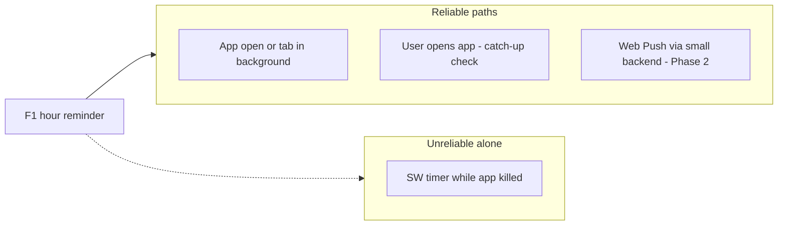
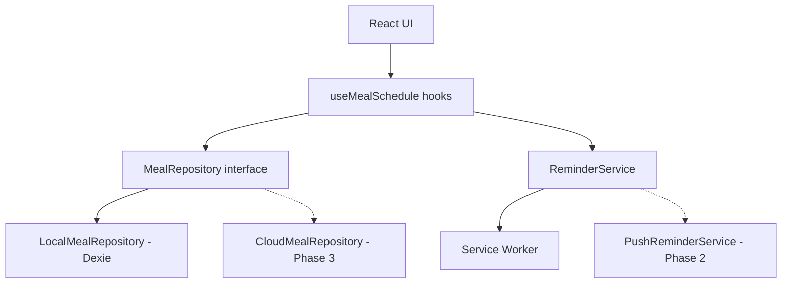
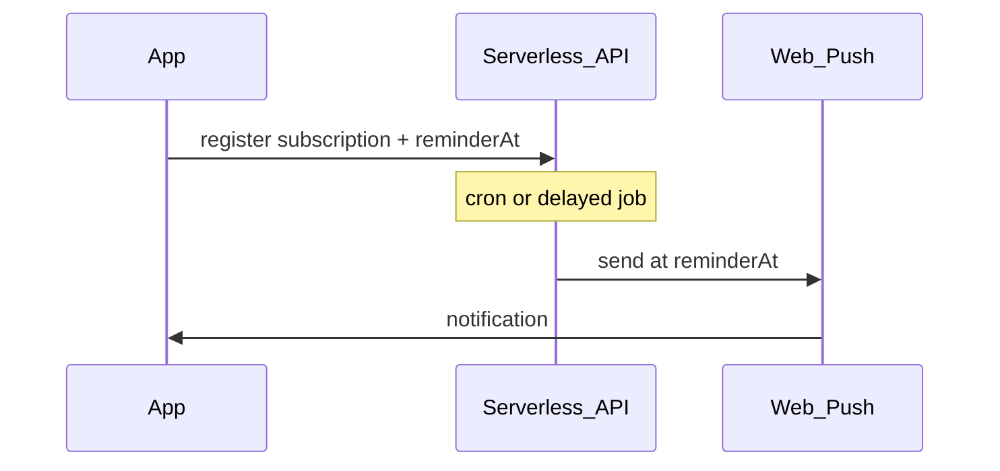

# Meal Reminder PWA — Requirements & Technical Design

## Product summary

A **local-first PWA** where you log a meal with a photo, enter **hours until your next meal**, and get a **reminder 1 hour before** that time. Data stays on the device initially; the design should make **cloud backup/sync** and **reliable background notifications** addable without rewriting core logic.

**Platform:** Web PWA (installable)  
**Storage (MVP):** On device only  
**Future:** Cloud sync + reliable Web Push reminders

---

## Requirements

### Functional (MVP)

| ID | Requirement |
|----|-------------|
| F1 | Capture or pick a meal photo (camera on mobile, file picker on desktop). |
| F2 | Enter **hours until next meal** (positive number; support decimals e.g. `2.5`). |
| F3 | Compute and persist **next meal time** = `loggedAt + hours`. |
| F4 | Show **current meal** (photo, logged time) and **countdown** to next meal. |
| F5 | Schedule a **“1 hour before next meal”** reminder (see notification strategy below). |
| F6 | On reminder tap, open the app to the home / log screen. |
| F7 | Allow **logging a new meal**, which replaces the active schedule and cancels/reschedules the previous reminder. |
| F8 | **History** of past meals (photo thumbnail, logged time, planned next meal time) — optional for MVP but low cost if data model is right. |

### Non-functional

| ID | Requirement |
|----|-------------|
| NF1 | **Offline-first**: core flows work without network after first load. |
| NF2 | **Installable PWA** (manifest, service worker, icons). |
| NF3 | **Privacy**: photos and schedule stored locally by default. |
| NF4 | **Extensible**: repository interfaces so cloud sync can plug in later. |
| NF5 | **Accessible**: labels on inputs, sufficient contrast, keyboard-friendly forms. |

### Out of scope (MVP)

- User accounts, multi-device sync, social sharing
- Nutrition / calorie tracking, AI meal recognition
- Multiple concurrent meal timers (one active schedule is enough for v1)

### User stories (acceptance)

1. **Log meal**: As a user, I take a photo, enter `3` hours, save → I see “Next meal at 6:30 PM” and a countdown.
2. **Reminder**: As a user, when it is 1 hour before next meal, I get a notification (or an in-app alert if the OS blocked background delivery).
3. **Next cycle**: As a user, I log my next meal → the old reminder is cleared and a new schedule starts.
4. **Re-open app**: As a user, if I missed a notification, opening the app shows “Eat in ~45 min” or “Meal time passed” and offers to log again.

---

## Critical platform constraint (notifications)

**Browsers do not reliably fire scheduled local notifications when the PWA is fully closed.** The Notification Triggers API (`TimestampTrigger`) was experimented with in Chrome but is **not production-ready** across browsers in 2025.



**MVP notification strategy (layered):**

1. **Primary (always)**: In-app countdown + banner when app is open or resumed.
2. **Catch-up on open**: Compare `now` vs `nextMealAt - 1h`; if in window, show notification or prominent UI.
3. **Best-effort background**: Service worker checks schedule when the app was recently used (e.g. on `visibilitychange` / SW `message` from client)—helps when tab is backgrounded, not when force-killed.
4. **Phase 2 for “true” 1h-before alerts**: Thin **Web Push** endpoint (serverless worker + VAPID). Stores only `nextMealAt` + subscription endpoint—not full photo sync. This is the standard way PWAs get dependable closed-app reminders.

**iOS note**: Web push for installed PWAs improved in recent iOS versions, but behavior still differs from native; document “Add to Home Screen + allow notifications” in onboarding.

---

## Technical design

### Stack (recommended)

New project under workspace: `meal-reminder/` — separate from `personal-website/`.

| Layer | Choice | Rationale |
|-------|--------|-----------|
| UI | **React 19 + TypeScript** | Familiar from your Next site; fast iteration |
| Build | **Vite** | Excellent PWA tooling |
| PWA | **vite-plugin-pwa** (Workbox) | Offline shell, SW registration |
| Storage | **IndexedDB via Dexie** | Photos as blobs, structured queries |
| State | **React context + hooks** or **Zustand** | Simple global “active schedule” |
| Styling | **Tailwind CSS** | Mobile-first layout |
| Tests | **Vitest** + Testing Library | Pure date/reminder logic |

Next.js is possible but heavier for a camera-centric mobile PWA; Vite keeps bundle and SW config simpler.

### High-level architecture



**Repository pattern** (cloud-ready from day one):

```typescript
interface MealRepository {
  getActiveSchedule(): Promise<MealSchedule | null>;
  logMeal(input: LogMealInput): Promise<MealSchedule>;
  listHistory(limit?: number): Promise<MealEntry[]>;
  clearActiveSchedule(): Promise<void>;
}
```

Phase 1: `LocalMealRepository` only. Phase 3: `SyncMealRepository` wrapping local + remote with conflict rules (last-write-wins on schedule is fine for v1).

### Data model

```typescript
interface MealEntry {
  id: string;              // uuid
  photoBlobId: string;     // reference to blobs table
  loggedAt: number;        // epoch ms
  hoursToNextMeal: number;
  nextMealAt: number;      // loggedAt + hours * 3600_000
  reminderAt: number;      // nextMealAt - 3600_000
  createdAt: number;
}

interface MealSchedule {
  entryId: string;
  nextMealAt: number;
  reminderAt: number;
}
```

**Dexie schema** (sketch):

- `meals`: indexed by `loggedAt`, `nextMealAt`
- `photos`: `{ id, blob }`
- `meta`: `{ key: 'activeEntryId', value: string }`

### Core domain logic (testable, no DOM)

`meal-reminder/src/lib/schedule.ts`:

- `computeNextMeal(loggedAt, hours)` → `nextMealAt`
- `computeReminderAt(nextMealAt)` → `nextMealAt - 1h`
- `getReminderState(now, reminderAt, nextMealAt)` → `'upcoming' | 'inReminderWindow' | 'due' | 'passed'`
- `formatCountdown(ms)` for UI

### Reminder service

`meal-reminder/src/lib/reminder-service.ts`:

| Method | Behavior |
|--------|----------|
| `requestPermission()` | Wrap `Notification.requestPermission()` |
| `scheduleFor(schedule)` | Register intent in IndexedDB `pendingReminder`; notify SW via `postMessage` |
| `cancel()` | Clear pending + close shown notifications by `tag` |
| `checkAndNotify(now)` | If `inReminderWindow`, `registration.showNotification(...)` |
| `onAppVisible()` | Call `checkAndNotify` (catch-up) |

Notification payload example:

- Title: `Meal in 1 hour`
- Body: `Time to plan your next meal.`
- `tag: 'meal-reminder'` (replace duplicates)
- `data: { url: '/' }` for click handling in SW

### UI screens (MVP)

1. **Home** — active countdown, last meal thumbnail, CTA “Log meal”
2. **Log meal** — photo preview, hours input (number), save
3. **History** (optional) — list from `meals` table
4. **Onboarding** — install hint, notification permission, iOS limitations copy

### PWA assets

- `manifest.webmanifest`: `name`, `short_name`, `display: standalone`, theme colors, icons 192/512
- Service worker: precache app shell; route `notificationclick` to focus/open client
- `meta` viewport + `apple-mobile-web-app-capable` for iOS install

### Security & privacy (local)

- No upload in MVP; blobs never leave device
- Revoke object URLs on unmount to avoid memory leaks
- Clear, explicit permission prompts for camera and notifications

---

## Cloud scale path (post-MVP)

### Phase 2 — Reliable reminders (minimal backend)

Not full sync—only reminder delivery:



- **Stack**: Cloudflare Worker / Vercel cron + Web Push (VAPID)
- **Data stored server-side**: `subscription`, `reminderAt`, `nextMealAt` (no photo required)
- Client: on `logMeal`, POST schedule; on new log, DELETE/cancel old job

### Phase 3 — Full cloud sync

- Auth (e.g. passkeys or magic link)
- Object storage for photos (S3/R2) + metadata in Postgres/Supabase
- `SyncMealRepository`: write-through local, background upload, pull on login
- Conflict: active schedule is single source; history merges by `id`

---

## Project structure (proposed)

```
meal-reminder/
  public/           # icons, manifest fragments
  src/
    app/            # App shell, routes if using react-router
    components/     # MealCard, PhotoCapture, Countdown, HoursInput
    hooks/          # useActiveSchedule, useReminderPermission
    lib/            # schedule.ts, reminder-service.ts
    repositories/   # meal-repository.ts, local-meal-repository.ts
    db/             # dexie.ts
    sw/             # custom SW hooks if needed
  index.html
  vite.config.ts
  package.json
```

---

## Implementation phases

### Phase 1 — MVP (local PWA)

1. Scaffold Vite + React + TS + Tailwind + vite-plugin-pwa
2. Dexie schema + `LocalMealRepository`
3. Photo capture component (`<input capture="environment">` + `getUserMedia` fallback)
4. Log meal flow + home countdown
5. `ReminderService` + permission onboarding + catch-up on app open
6. SW `notificationclick` handler
7. Basic Vitest tests for schedule math

**Definition of done**: User can log meal with photo, set hours, see countdown; receives notification when app is open or on next open within reminder window; PWA installable.

### Phase 2 — Dependable 1h-before push

1. Serverless API + VAPID keys
2. Client push subscription on permission grant
3. Schedule/cancel jobs on server when meals are logged

### Phase 3 — Cloud backup

1. Auth + photo upload + sync repository
2. Multi-device active schedule policy (document: “latest device wins”)

---

## Open decisions (defaults assumed)

| Topic | Assumption for plan |
|-------|---------------------|
| App name | Working title: **Meal Reminder** |
| Hours input | Single field; validated `0.25`–`24` |
| Timezone | Device local time only |
| One active timer | Yes |
| History in MVP | Yes (cheap with Dexie) |

---

## Risks & mitigations

| Risk | Mitigation |
|------|------------|
| No notification when app killed | Phase 2 Web Push; MVP catch-up UI + clear UX copy |
| iOS PWA quirks | Install + permission guide; test on real device early |
| Large photos filling storage | Resize client-side (canvas) to max ~1200px before blob save |
| IndexedDB quota | Compress images; optional “clear old history” in settings later |

---

## Implementation checklist

- [ ] Scaffold `meal-reminder/` with Vite, React, TS, Tailwind, vite-plugin-pwa, Dexie
- [ ] Implement `schedule.ts`, `MealRepository`, `LocalMealRepository`, Dexie schema
- [ ] Build photo capture, hours input, log flow, home countdown + history list
- [ ] `ReminderService`: permission, catch-up on open, SW `notificationclick`, best-effort SW scheduling
- [ ] Vitest for schedule/reminder logic; onboarding copy for iOS + notification limitations
- [ ] **Later:** serverless Web Push for reliable 1h-before alerts when app is closed
- [ ] **Later:** auth, photo upload, `SyncMealRepository` for multi-device backup

---

## Suggested first implementation task

Scaffold **`meal-reminder/`** with Vite PWA, implement `schedule.ts` + Dexie + log-meal screen, then wire reminder permission and catch-up notifications before any backend work.
